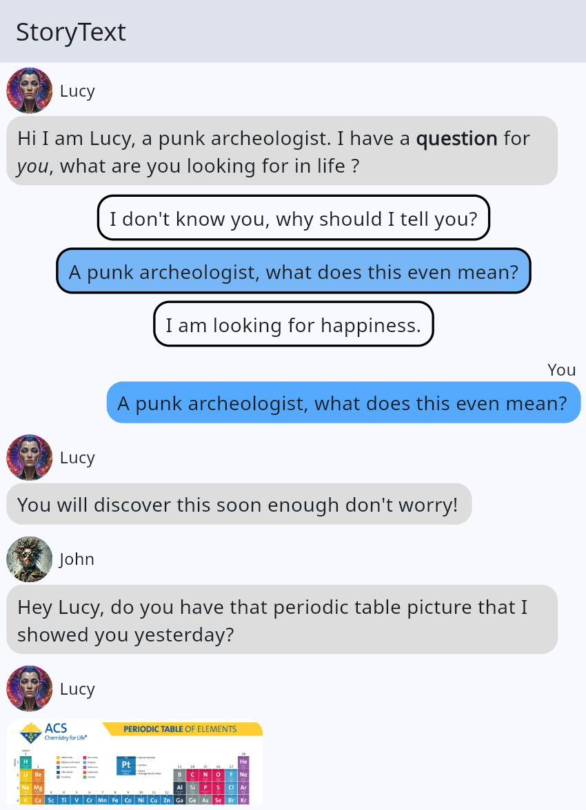

# StoryText

Interactive cross-platform book application basis that combines elements of a messaging app with branching storylines.

You can use this base to write any story in a group chat messaging interactive format.
Different virtual personas are interacting as they were chatting all together on a group chat.
The reader can interact by answering some predefined multiple choice questions (MCQ) and altering the course of the story.

On the writer side of things, everything is defined in the `content.yaml` file.
You can check a fully featured example [content.yaml](./assets/content/content.yaml).

## Features

The StoryText interactive book application currently supports the following features:

- Sending predefined text messages on a chat-like interface
- Multiple personas with profile picture
- Branching storylines with user answered MCQs
- Markdown text messages (hyperlinks, bold, italic, titles, ...)
- Delay for "reading" and "sending" next message (based on text length)
- Fake "is typing" indicator
- "Writer mode" allows to cheat and jump to restart the story at a given message ID (long click on app bar title)
- Persistent storage of current position in the story as well as all explored paths
- Change past choice in previously answered MCQs to explore new paths
- Visual indicator of undiscovered/discovered/current path on MCQs answers
- Send pictures (works offline with assets) along with source link

You can check the "roadmap" for future features: [project board](https://github.com/users/gruvw/projects/4).

### Example

You can check out a live (very basic) example showing off every feature of StoryText here: <>.

<!-- TODO live example -->

## Usage

To create you own story using this template you should follow the steps below:

<!-- TODO explain how to install/create a book repo -->

## Written with StoryText

You can find below a list of books written using StoryText:

- None yet :)

## Contributions

Feel free to contribute by submitting pull requests, whether to add new features, improve existing functionality, or fix bugs :)

Before opening a new PR, make sure to open an issue to discuss it beforehand (first check if a similar issue does not already exist).
